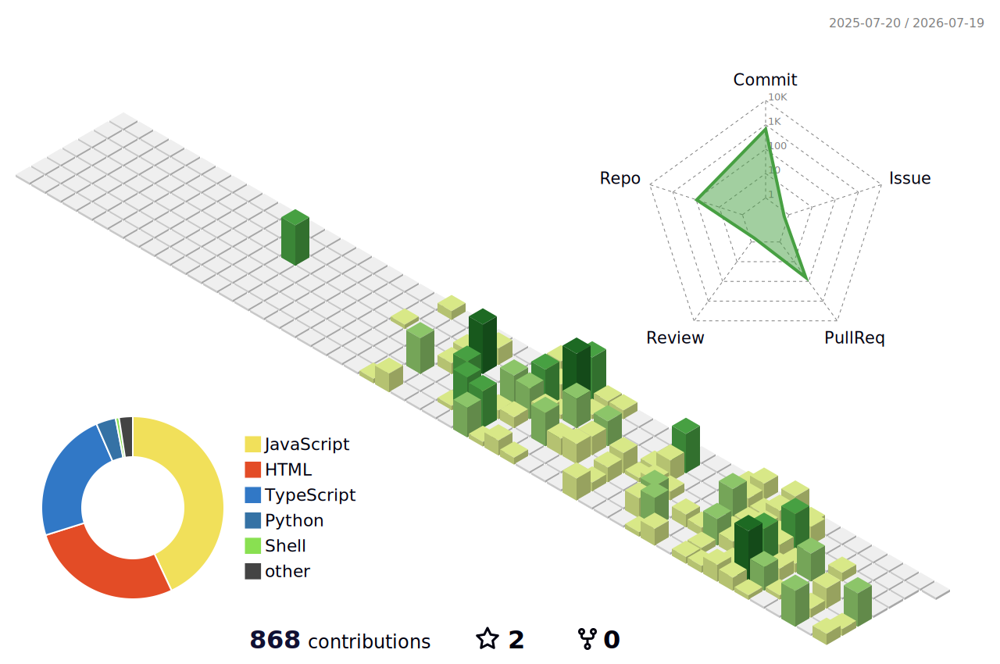

I’m @robbie-med. Interested in making tools. Tools should help people do more, better work faster. Most of my tools only do one of these. 
See my polished tools and reach me at robbiemed.org

<!---
robbie-med/robbie-med is a ✨ special ✨ repository because its `README.md` (this file) appears on your GitHub profile.
You can click the Preview link to take a look at your changes.
--->

